# ESP32 String Lights Controller

MQTT-enabled controller for string lights with multiple effects, designed for ESP32.

## Features

- MQTT control integration
- Physical button control
- Multiple lighting effects
- Persistent state across power cycles
- HomeAssistant compatible

## Hardware Setup

- ESP32 development board
- Relay module (connected to pin 16)
- Push button (connected to pin 2)
- Transistor for effect control (base connected to pin 4)
- LED string lights (connected through relay)

### Wiring Diagram

```mermaid
graph LR
    subgraph Controller board
      subgraph ESP32
        H([fa:fa-minus &nbsp;Common GND]) -->|GND| A[fa:fa-microchip &nbsp;ESP32]
        A -->|3.3V| I([fa:fa-plus &nbsp;Common 3.3V])
      end

      A -->|Pin 16| B[fa:fa-toggle-off &nbsp;Relay]
      B -->|GND| H
      I -->|3.3V| B
      C[fa:fa-circle-dot &nbsp;Button] -->|Pin 2| A
      I -->|3.3V| C
      A -->|Pin 4 - Base| D[fa:fa-toggle-off &nbsp;Transistor]
      G[fa:fa-bolt &nbsp;HI-Link power adapter] -->|3.3V| I
      H -->|GND| G
    end

    subgraph Original controller board
      D -->|GND - Emitter| E[fa:fa-lightbulb &nbsp;String lights]
      E -->|≈ 3.3V - Collector| D
      E -->|GND| A

      F([fa:fa-plug &nbsp;220V AC power]) ==>|Live 220V| B
      B ==>|Live 220V| E
      E ==>|Neutral| F
      F ==>|Live 220V| G
      G ==>|Neutral| F
    end

    linkStyle 1 stroke: red
    linkStyle 2 stroke: yellow
    linkStyle 4 stroke: red
    linkStyle 5 stroke: yellow
    linkStyle 6 stroke: red
    linkStyle 7 stroke: yellow
    linkStyle 11 stroke: red
    linkStyle 13 stroke: #926243
    linkStyle 14 stroke: #926243
    linkStyle 15 stroke: #016FDE
    linkStyle 16 stroke: #926243
    linkStyle 17 stroke: #016FDE
```



## Software Configuration

1. Copy `src/config.h.template` to `src/config.h`
2. Edit `src/config.h` with your credentials:
   ```cpp
   const char *ssid = "YOUR_WIFI_SSID";
   const char *password = "YOUR_WIFI_PASSWORD";
   const char *mqtt_server = "YOUR_MQTT_SERVER";
   ```

## MQTT Topics

- `home/livingroom/string-light` - Power control (ON/OFF)
- `home/livingroom/string-light/effect` - Effect control

### Available Effects

- IN_WAVES
- SEQUENTIAL
- SLO_GLO
- CHASING
- FADE
- TWINKLE
- STATIC
- COMBINATION

## Operation

### Physical Control
- Short press button: Cycle through effects
- Light indicates effect change through blink patterns

### MQTT Control
- Send "ON"/"OFF" to power topic
- Send effect name to effect topic

## Development

Built using PlatformIO. Main components:
- WiFi connection management
- MQTT client for remote control
- Effect cycling logic
- Hardware interrupt handling

### Building

1. Install PlatformIO
2. Configure credentials in `src/config.h`
3. Build and upload:
   ```bash
   pio run -t upload
   ```

## Troubleshooting

1. **No MQTT Connection**
   - Check MQTT server address
   - Verify WiFi credentials
   - ESP32 will attempt 10 reconnections

2. **Effect Not Changing**
   - Verify transistor connections
   - Check effect name spelling in MQTT messages
   - Monitor serial output for debugging

## Security Note

`config.h` is gitignored to prevent credential leaks. Always use the template file as reference and keep your credentials secure.
